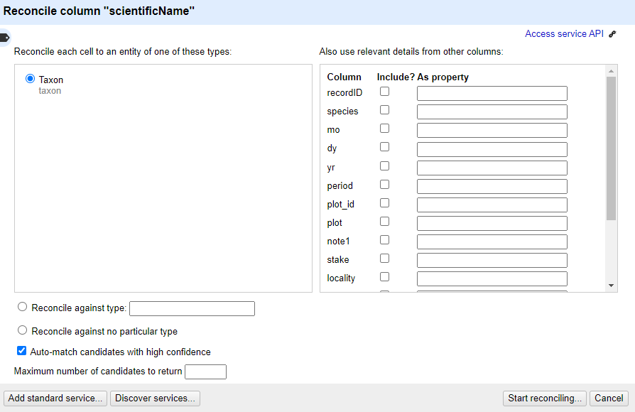

## Reconciliation of names

Reconciliation services allow you to lookup terms from your data in OpenRefine against external services, and use values from the external services in your data. The official User Manual provides [detailed information about the reconciliation feature](https://docs.openrefine.org/manual/reconciling).

Reconciliation services can be more sophisticated and often quicker than using the method described above to retrieve data from a URL. However, to use the `Reconciliation` function in OpenRefine requires the external resource to support the necessary service for OpenRefine to work with, which means unless the service you wish to use supports such a service you cannot use the `Reconciliation` approach.

There are a few services where you can find an OpenRefine Reconciliation option available. For example Wikidata has a reconciliation service at [https://wikidata.reconci.link/](https://wikidata.reconci.link/).

## Reconcile scientific names with the Encyclopedia of Life (EOL)

We can use the [Encyclopedia of Life](https://eol.org/) Reconciliation service to find the taxonomic matches to the names in the dataset.

1. In the `scientificName` column use the dropdown menu to choose 'Reconcile->Start Reconciling'
1. If this is the first time you've used this particular reconciliation service, you'll need to add the details of the service now
    * Click 'Add Standard Service...' and in the dialogue that appears enter:
        * https://eol.org/api/reconciliation
         
1. You should now see a heading in the list on the left hand side of the Reconciliation dialogue called "Encyclopedia of Life"
1. Click on this to choose to use this reconciliation service
1. In the middle box in the reconciliation dialogue you may get asked what type of 'entity' you want to reconcile to - that is, what type of thing are you looking for. The list will vary depending on what reconciliation service you are using.
    * In this case, the only option is "Taxon"
1. In the box on the righthand side of the reconciliation dialogue you can choose if other columns are used to help the reconciliation service make a match - however it is sometimes hard to tell what use (if any) the reconciliation service makes of these additional columns
1. At the bottom of the reconciliation dialogue there is the option to "Auto-match candidates with high confidence". This can be a time saver, but in this case you are going to uncheck it, so you can see the results before a match is made
1. Now click 'Start Reconciling'

   

Reconciliation is an operation that can take a little time if you have many values to look up.

Once the reconciliation has completed two Facets should be created automatically:

* scientificName: Judgement
* scientificName: best candidate's score

These are two of several specific reconciliation facets and actions that you can get from the 'Reconcile' menu (from the column drop down menu).

Close the 'scientificName: best candidate's score' facet, but leave the 'scientificName: Judgement' facet open.

If you look at the scientificName column, you should see some cells have found one or more matches - the potential matches are shown in a list in each cell. Next to each potential match there is a 'tick' and a 'double tick'. To accept a reconciliation match you can use the 'tick' options in cells. The 'tick' accepts the match for the single cell, the 'double tick' accepts the match for all identical cells.

1. Create a text facet on the scientificName column
1. Choose *Ammospermophilus harrisii*
  * In the scientificName column you should be able to see the various potential matches. Clicking on a match will take you to the EOL page for that entity.
  
1. Click a 'double tick' in one of the scientificName column cells for the option `*Ammospermophilus harrisii* (Audubon & Bachman 1854)`
1. This will accept this as a match for all cells - you should see the other options all disappear

There are two things that reconciliation can do for you. Firstly it gets a standard form of the name or label for the entity. Secondly it gets an ID for the entity - in this case a page and numeric id for the scientific name in EOL. This is hidden in the default view, but can be extracted:

1. In the scientificName column use the dropdown menu to choose 'Reconcile` > `Add entity identifiers column...'
1. Give the column the name 'EOL-ID'
1. This will create a new column that contains the EOL ID for the matched entity

  
